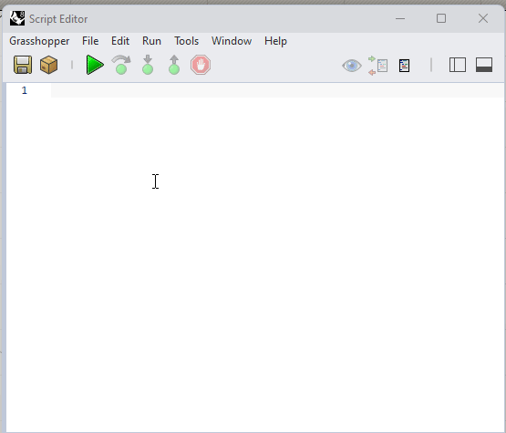
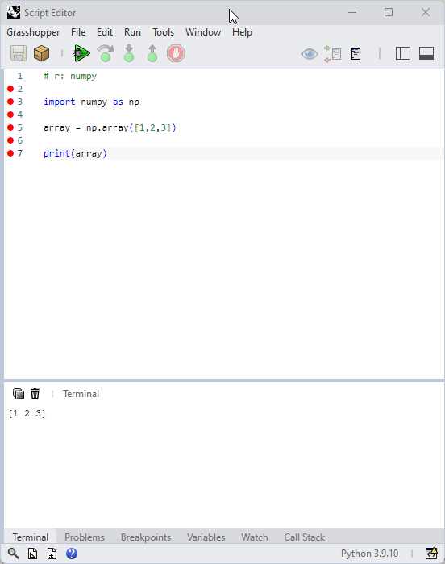
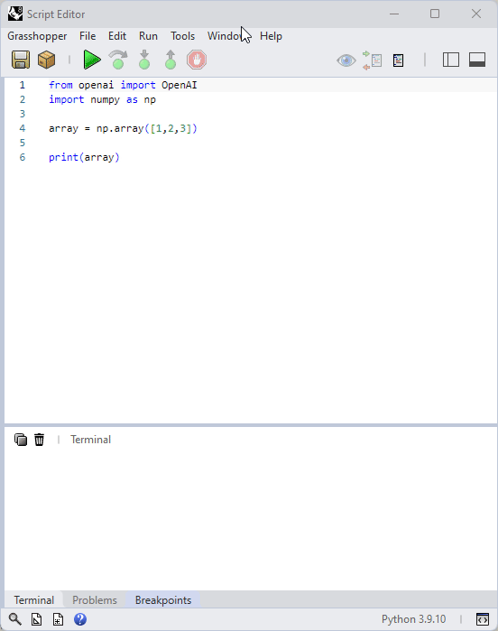

### Using External Python Libraries with Rhino 8 and Grasshopper

Rhino 8 now has support for Python 3.  As of today (October 27, 2024) the specific flavor of python used in Rhino/GH is Python 3.9.10. This was a long-awaited feature addition that came with Rhino 8. 

Along with the upgrade to python 3, there is now also the ability to (more) easily install external packages. There are a few ways that this functionality is provided in Rhino/GH.

There is fairly limited information online for how to do this. The main info I have found is [here](https://discourse.mcneel.com/t/new-python-editor-venv/165673/18) on the McNeel forum from Scott Davidson, though I may have missed the main source.

Generally there are three ways you can add external packages. 

The first two ways make it quite easy to specify a package which is installed in a special location on your computer to prevent it from interfering with any other installed packages. You are welcome to use these methods, however I have experienced some issues when using them on Rhino 8 releases to date.

The third method is a bit more involved to set up but is also (in my experience) generally more stable. This is the method I personally use for installing additional packages and would recommend for now if you are planning to do a lot of python development in grasshopper/rhino. The downside is that this method generally makes your code less distributable to others since it may require them to also set up a virtual environment and install the same packages that you have installed. 

#### Method 1 and 2 | Built-in environment:

One way is through a special requirement syntax. e.g.

```
# r: numpy
```
or 
```
# requirements: numpy
```

Upon running your script this will use pip to check if the required package is installed, if it is not installed then an installation will be attempted. If the installation procedure is successful you should be able to import your library as usual and use its functionality.

```
# r: numpy

import numpy as np

array = np.array([1,2,3])

print(array)
```
If everything has gone to plan then this should print:

```
[1 2 3]
```

There is also a second way to install packages which involves clicking the *package* button or opening the command prompt. In the command prompt there is a menu item called `Install Package` which will open a nice little installer window. 

**Package Button**



**Command Prompt**



In my experience, these methods of package installation have, so far, been fairly brittle.

I have had lots of issues with corrupted environments requiring me to reset the entire python 3 environment. To do this you will need to open the python editor in your Rhino window which can be done by entering the `ScriptEditor` command then going to `Tools > Advanced > Reset Python 3 (C Python) Runtime` and restarting rhino. This will remove all installed python packages and reset python. Then upon the next running of the `Script` component in grasshopper python will be set up again and you can try installing your packages again.

It is not clear if there is a nice way to *uninstall* packages installed using this method other than by going into the folder where these packages are installed and deleting the folder directly from there. 

Additionally, when upgrading rhino during minor releases it appears that the python environments are reset and all installed packages are wiped out. This can be quite annoying if you are working with something like pytorch which (with cuda support is something like 3gb) can take a while to download and install every time you update rhino.

I understand that the team at McNeal is trying to make this process as easy as possible and that it is definitely not as simple as it appears. I expect that this process will improve over time, however for now I would recommend an alternative approach of using a [virtual environment](https://packaging.python.org/en/latest/guides/installing-using-pip-and-virtual-environments/#create-and-use-virtual-environments).

#### Method 3 | Virtual Environment

The third method for installing external libraries involves managing the installation yourself and then telling Rhino/GH where to look for external libraries. 

The process for installing and setting up virtual environments for Windows and Mac are different so I am providing setup instructions for each platform separately below. Both require you to install a standalone version of Python 3.9.10. 

Somewhat confusingly, you won't be using this installation of python to run the code inside of grasshopper. There is another version of python that McNeel ships with Rhino 8. This installation of python (currently based on version 3.9.10) is the one that actually does something inside of rhino.

We will install the same version that is used inside of Rhino to hopefully manage some package dependency issues. 

##### Windows Setup

The first thing you will need to do is to download python 3.9.10 for your operating system. You can do this [here](https://www.python.org/downloads/release/python-3910/).

At the bottom of the page you will see two Windows installers. Unless you are working with a very old version of Windows you should download the 64-bit installer.

Go ahead and run the installer. Use all of the default settings. DO NOT ADD TO PATH!

Next, open the command prompt application on your computer. By default it should open in your user folder:

```
C:\Users\Adam>
```
. Before you do anything else, check that python was installed properly. If you type:

```
C:\Users\Adam> py --list
```
into the command prompt and press enter, you should see your python 3.9 version listed as one of the options. If you don't have any errors you can proceed to the next step. 

Now you can enter the following command into the command prompt:
```
C:\Users\Adam> py -3.9 -m venv ghpython
```
This command is saying `use python 3.9 with its built-in module venv to create a new virtual environment called ghpython`. You can change the name of the environment to anything you like, but if you call it `ghpython` it will make further instructions easier to follow.

After this command completes you should be able to activate your new virtual environment. To do this enter the following command into the command prompt:
```
C:\Users\Adam> ghpython\scripts\activate
```
If this runs and works correctly you should see the name of your environment appear at the beginning of the new line in the command prompt. I.e. you should see:
```
(ghpython) C:\Users\Adam>
```
Now that you have activated your environment, you can begin installing additional packages here. The first thing to do is to check out what you already have installed. 

```
(ghpython) C:\Users\Adam> pip list
```
This should list any packages that are already installed an their version. You should see that `pip` is already installed. [Pip](https://packaging.python.org/en/latest/guides/tool-recommendations/) is the standard tool for installing packages from [PyPI](https://packaging.python.org/en/latest/glossary/#term-Python-Package-Index-PyPI).

You can now use pip to install packages and they will be installed for your virtual environment. 

To use pip you just type `pip install` and then the package you would like to include. For example, to install numpy:

```
(ghpython) C:\Users\Adam>pip install numpy
```

You may get a warning that pip could be upgraded. The provided instructions are probably a bit confusing. Since you are inside of a virtual environment, each environment will have its own version of pip. To upgrade pip you should just be able to run:

```
(ghpython) C:\Users\Adam>pip install --upgrade pip
```
This is good practice, but probably not strictly necessary.

Anytime you want to install other modules you can reactivate this virtual environment and install packages in the same way. Pip has a number of other commands that can be viewed with the -h flag:
```
(ghpython) C:\Users\Adam>pip -h
```
You can now proceed to the section on how to tell rhino and/or grasshopper where to look for additional packages.

##### Mac Setup

Macs come, by default, with a version of python already installed. This version does a bunch of things already so we definitely don't want to mess with it. There are lots of ways to manage installations of python on a mac but the method I am recommending is to use [`pyenv`](https://github.com/pyenv/pyenv).

Instead of downloading a compiled version of python from the python.org website as you did for Windows, you can instead use `pyenv` to install different versions of python and to set up virtual environments. 

There are a few prerequisites for using `pyenv`. First, I will recommend that you use [`homebrew`](https://brew.sh/) which can be downloaded and installed using the instructions here: https://brew.sh/.

Once you have homebrew installed you can follow the instructions [here](https://github.com/pyenv/pyenv?tab=readme-ov-file#installation) or (using homebrew) first open a terminal and enter:

```
brew update
brew install pyenv
```

Then you will need to [set up your shell environment for pyenv](https://github.com/pyenv/pyenv?tab=readme-ov-file#set-up-your-shell-environment-for-pyenv). If you terminal is using bash, follow the bash instructions, if using zsh, follow the zsh instructions. You can switch between these by entering 
```
adam@Adams-MBP ~ % bash
```
or
```
adam@Adams-MBP ~ % zsh
```
I tend to use zsh, but I am not yet really a mac user so your preference will dictate here. For zsh you would paste the following into your terminal:
```
adam@Adams-MBP ~ % echo 'export PYENV_ROOT="$HOME/.pyenv"' >> ~/.zshrc
adam@Adams-MBP ~ % echo '[[ -d $PYENV_ROOT/bin ]] && export PATH="$PYENV_ROOT/bin:$PATH"' >> ~/.zshrc
adam@Adams-MBP ~ % echo 'eval "$(pyenv init -)"' >> ~/.zshrc
```
This will add pyenv to your path. Then you can quit and restart your terminal manually or with:
```
adam@Adams-MBP ~ % exec "$SHELL"
```
Now you should be able to type:
```
adam@Adams-MBP ~ % pyenv
```
This should list a bunch of options and commands for pyenv. The first thing you will want to do is to install python 3.9.10. To do this you will enter the following:

```
adam@Adams-MBP ~ % pyenv install 3.9.10
```
Now if you type:
```
adam@Adams-MBP ~ % pyenv versions
```
You should see 3.9.10 listed. 

To create a virtual environment where you can begin to install packages you can type:

```
adam@Adams-MBP ~ % pyenv virtualenv 3.9.10 ghpython
```
This will use `pyenv` to create a virtual environment named `ghpython` using python 3.9.10.

Next you need to activate this virtual environment. To do this you enter:

```
adam@Adams-MBP ~ % pyenv activate ghpython
```

Now you should see `(ghpython)` added to the beginning of you line. If you enter:

```
(ghpython) adam@Adams-MBP ~ % pip list
```
You should see any installed packages. 

From here you can proceed using `pip install`. For example to install numpy:

```
(ghpython) adam@Adams-MBP ~ % pip install numpy
```
From here the same instructions about upgrading pip and viewing other commands are the same as they are on Windows. 

You can proceed to the next section on how to point rhino/grasshopper to your installed packages. These instructions are the same for mac and windows.

#### Tell Rhino and/or Grasshopper where to look for additional packages

There are two ways to tell rhino/gh where to look for additional libraries.

**Environment Syntax**

The first is using the special environment syntax. On my computer this looks like this on Windows:

```
# env: C:\Users\Adam\ghpython\Lib\site-packages
```
or this on Mac

```
# env: /Users/adam/.pyenv/version/3.9.10/envs/ghpython/lib/python3.9/site-packages
```

If you include this at the top of each of your python components then you should be able to install any packages that you have added to your virtual environment.

**Add Search Path in Rhino/Grasshopper**

Alternatively you can set this path by going to the Script Editor `Tools > Options` then select the `Python 3` tab. In the `Module Search Paths` section there is a `+` button to add a search path. Here you can enter the path to the *site-packages* installed for your virtual environment. 




With this method you will not need to add any additional search path at the top of each script, you can just import as needed. This is the method that I use. 


